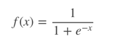

### 关于逻辑回归中使用sigmoid的函数

其数学表达式为：

其函数图像如下：

可以看出，sigmoid函数连续，光滑，严格单调，以(0,0.5)中心对称，是一个非常良好的阈值函数

当x趋近负无穷时，y趋近于0；趋近于正无穷时，y趋近于1；x=0时，y=0.5。当然，在x超出[-6,6]的范围后，函数值基本上没有变化，值非常接近，在应用中一般不考虑

Sigmoid函数的值域范围限制在(0,1)之间，我们知道[0,1]与概率值的范围是相对应的，这样sigmoid函数就能与一个概率分布联系起来了。

Sigmoid函数的导数是其本身的函数，即，计算非常方便，也非常节省计算时间。推导过程如下：

虽然sigmoid函数拥有良好的性质，可以用在分类问题上，如作为逻辑回归模型的分类器。但为什么偏偏选用这个函数呢？除了上述的数学上更易处理外，还有其本身的推导特性。
对于分类问题，尤其是二分类问题，都假定是服从伯努利分布。伯努利分布的概率质量函数PMF为：