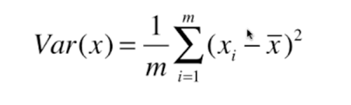
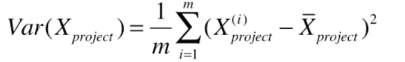

### 关于主成分分析 (Principal Component Analysis) (PCA)

- 一个非监督的机器学习算法
- 主要用于数据的降唯
- 通过降维，可以发现更便于人类理解的特征
- 其他应用： 可视化；去燥

如何找到这个样本间间距最大的轴？

如何定义样本间距？

使用方差(Variance)

方差就是描述样本的疏密程度

- 第一步： 将样本进行 demean 处理 (均值归零处理)
- 第二步： 求一个轴的方向 w  = (w1, w2)
- 第三步： 使得我们所有的样本，映射到w以后，有

关于数据预处理的几个方法
1： 白话
2： 去均值
3： 归一化
4： PCA

(这个专门写个整理)

