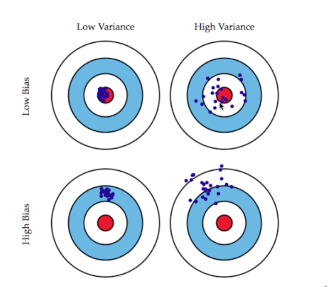

### 偏差 (bias) 和方差 (variance) 

从图上直观的观察偏差和方差。

bias基本文字解释： 就是描述的是预测值的期望值与真实结果直接的差距，偏差越大。越偏离真实数据。
variance: 描述的是预测值变化的范围，离散程度，也就是，也就是期望值的距离，方差越大，数据分部越离散。结合上图就很能很好的理解。

### 关于模型中的误差

模型误差 = bias + variance + 不可避免的误差（比如一开始数据的采集就存在误差）

关于bias and variance是和我们关发有关的。

比如：bias。 一开始对问题本身的假设不正确，比如非线性数据使用线性回归。

比如： variance：数据的一点点变化都会较大的影响模型。通常原因。使用的模型太复杂。比如高阶多项式的回归。

### 结合实际的算法

KNN：高方差的算法

一般来讲： 非参数学习的算法都是高方差的算法，因为不对数据惊醒任何的假设

线性回归：高偏差算法

参数学习通常都是高偏差算法。因为对数据具有极强的假设。

### 对于参数的调整

大多数的算法具有对应的参数。来调整偏差和方差。

比如在KNN中， K越大。我们的模型是越简单的如果K等于我们的样本总数量，其实就是样本中哪个最多就预测哪个。这个时候我们可以知道
方差是最小的，偏差是最大的。

再比如多项式回归，如果阶数越大，模型越复杂，模拟的曲线也会越弯曲复杂，方差也会越来越大。如果阶数为1的时候，此时的偏差是最大的。

### 矛盾

通过上面的结论 我们可以知道 bias和variance是存在矛盾的。

- 降低偏差，就会提高方差
- 降低方差，会提高偏差

其实机器学习的主要挑战。来自于方差。

解决高方差的通常方法：
- 降低模型复杂度
- 减少数据纬度，降噪
- 增加样本数
- 使用验证集
- 模型正则话