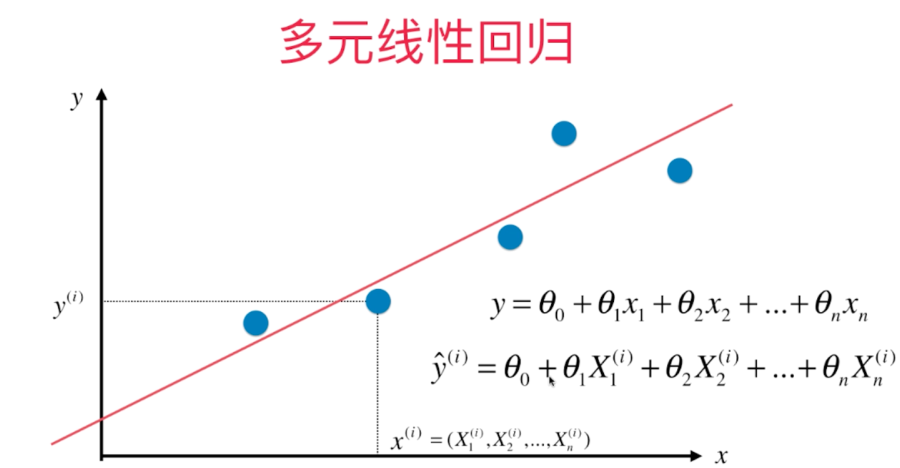
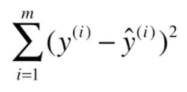
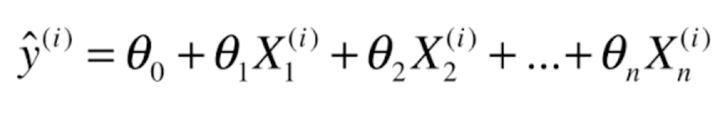
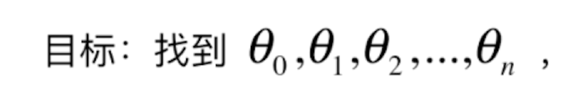
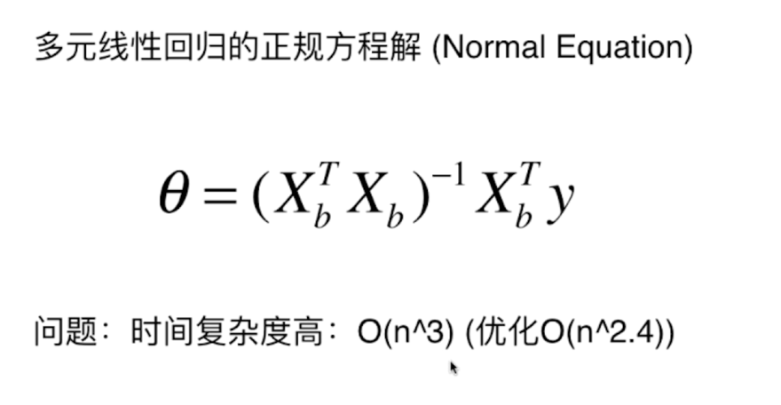

### 关于多元线性回归

对于回顾分析中，如果有2个以上的自变量，就称之为多元回归。实际中，一种现象是多个因素相联系的，有多个自变量的最优组合共同来预测活
估量因变量，比只用一个自变量进行预测或估计更加有效，更加符合实际，因此多元线性回归比一元线性回归的实际意义更大

在前面一元线性回归中。我们说为了尽可能的使得损失函数小。必须尽可能的使得目标函数

 尽可能的小

那么多元线性回归中 y的近似值成了

所以，多元线性回归中，我们的目标依然是 找到 西塔 使得目标函数尽可能的小。

对于线性回归的求解和推导公式...

多元线性回归的正规方程解

优点： 不需要对数据进行归一化处理

