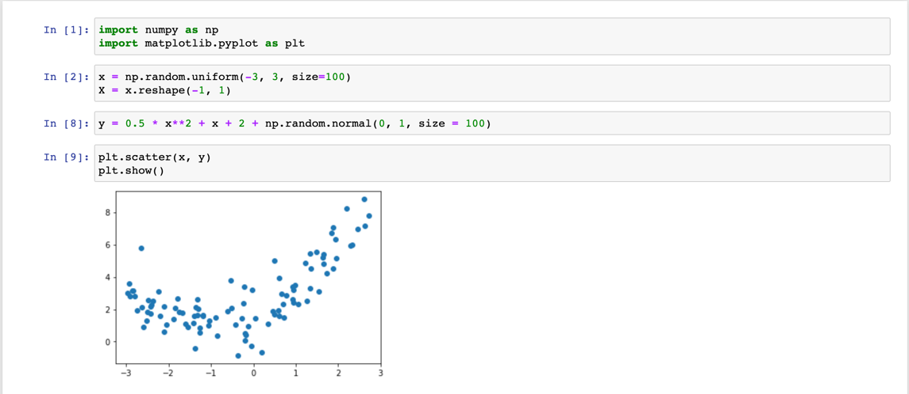
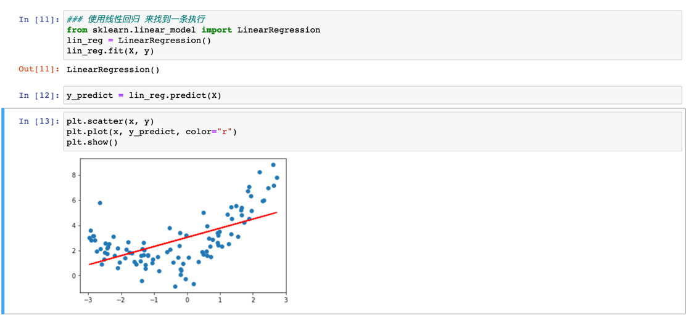
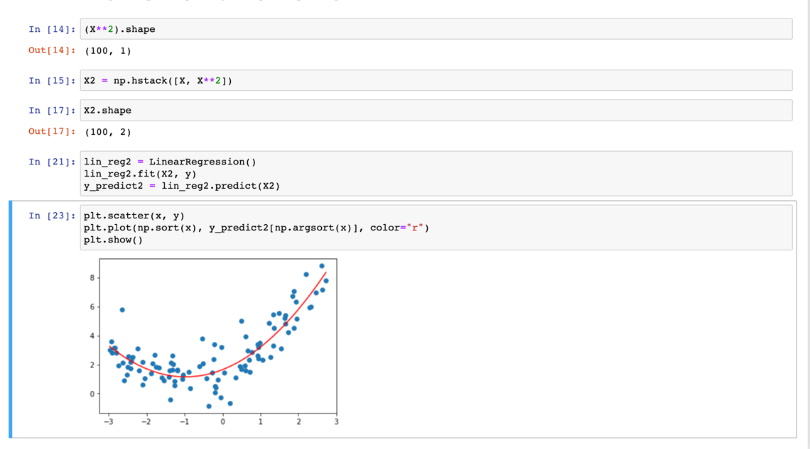
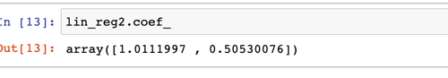
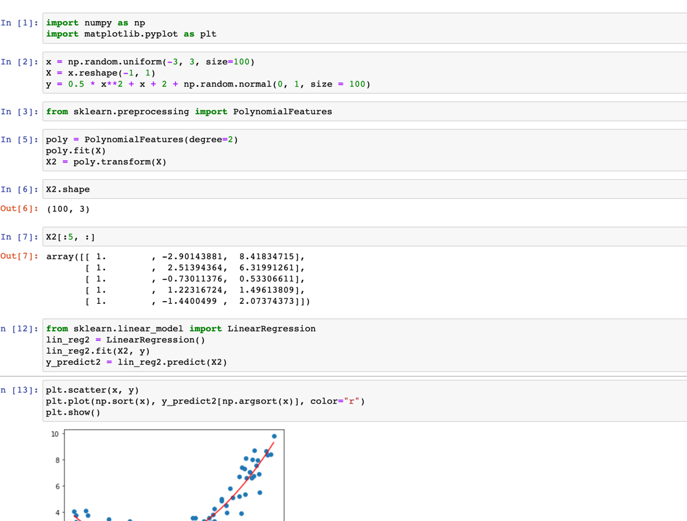

### 关于多项式回归

我们说 直线回归研究的一个应变量和一个自变量直接的回归问题，但是在实际中，影响应变量的自变量往往不止一个，而是多个，
因此。需要进行一个应变量与多个自变量之间的回归分析，即多元线性回归。

研究一个应变量与一个或者多个自变量间多项式的回归分析方法。称之为多项式回归

先模拟部分数据和场景

如图所示 我们在-3，3之间取100个数， 作为我们的特征，再定义一个二次曲线

我们先用线性回归的方式找到一条直线 满足这些特征

如图所示，其实 我们一开始就能发现。我们的特征大概是一个曲线的状态。那么使用线性回归解决。其拟合效果很明显是不够好的，
那么如何解决这个问题呢？

### 解决方案。添加一个特征

如图 我们可以很明显的看到 此时的曲线更加切合现有的数据分布

其实对于X是我们新创建的一个向量。是一组新的数据。这里有个问题，就是为什么要以x**2 为新的数据呢？

目前个人感觉是根据数据的特点，或者说图像的特点总结其规律和特点，对参数进行多次的实验，另一方面这也是模型需要调参的原因。

在这 我们可以看看现在模拟的曲线的相关系数

我们可以发现和我们生成数据的曲线参数是拟合的(有部分的误差，在生成数据的时候我们加入了噪音)

### 在scilit-learn中多项式回归和Pipeline

