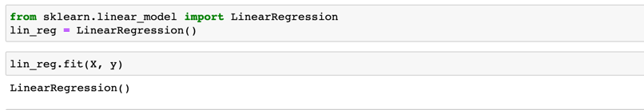
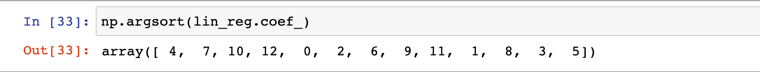

### 一些讨论

1:  可解释性

我们先基于scikit-learn实现一个线性回归， 如图所示：

那么对于 lin_reg.coef_, 即： 模型的回归系数

我们可以看到，回归系数中有正有负，那么，正回归系数表示y随着x的增大而增大，负回归系数表示随着y随着x的增大而见效。
比如在回归方程式y=kx+b中， 斜率b称为回归系数。

***而绝对值的大小就决定了其影响程度***

我们对其回归系数进行排序看看结果：

使用np.argsort(array), 返回的是元素的值按照从小到大排序后的索引值的数组。

在看我们数据的特征

所以在我们得到回归系数的排序，就可以得到相关特征对结果的影响程度

比如在这个demo中 RM (房间的数量) 越多多，放假越高，这是一个正向的影响

所以，根据此情况 我们可以收集和丰富相关的特点，来更好的描述这个模型。能更好的解释解释这个模型。

### 线性回顾的总结：

对于线性回归，是典型的参数学习， 对笔记KNN，KNN是参数学习
只能解决回归问题， KNN既可以解决分类问题，又可以解决回归问题。

其实，线性回归对数据又假设： 就是线性关系
对比KNN， 对数据没有假设。

线性回归优点： 对数据具有强解释性

多元线性回归的正规方程解：

