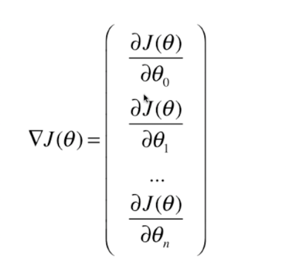

### 最小二乘法

目标： 找到 a和b  使得以下式子尽可能的小

如何找最小值

极值：极值是一个函数的极大值或者是极小值，如果一个函数在一个点的领域内处处都有值，而已该点出的最大值（小）这函数在改点出就是一个极大（小）值。
如果他比领域内其他各点的值都大（小）他就是一个严格极大（小）值。该点就相应的称为一个极值点或严格极值点。

性质：极值处导数为0或者不可导

 
关于求导：

求导是数学计算中的一个计算分方法。
定义是： 当自变量的增量趋于0时，应变量的增量与自变量的增量之商的极限。
在一个函数存在导数时候，称之为这个函数可导或者是可微分。可导的函数一定是连续的，不连续的函数一定不可导。

常数求导： c` = 0  都是0
