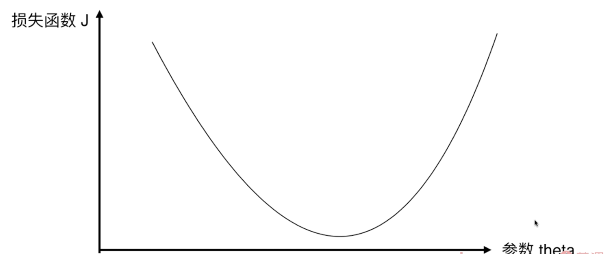
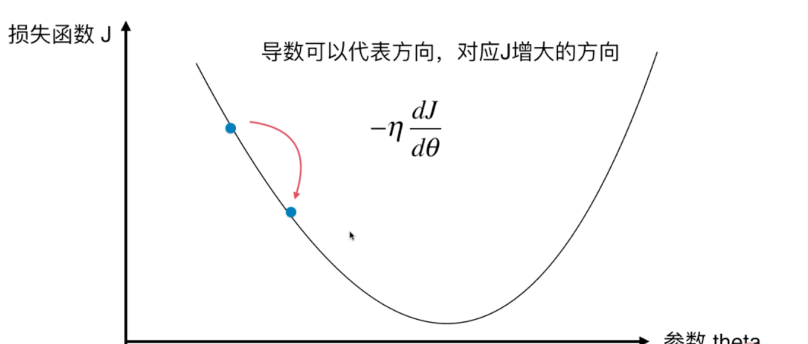
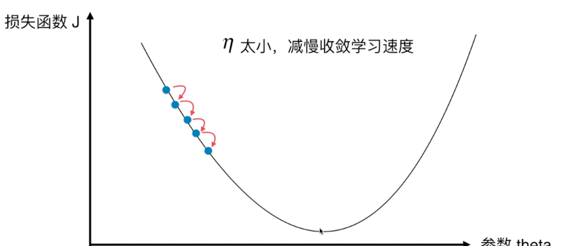
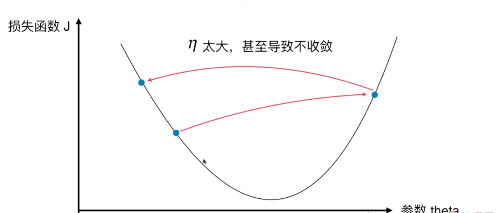
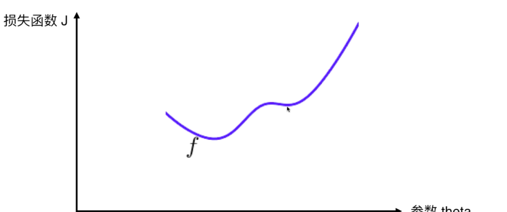
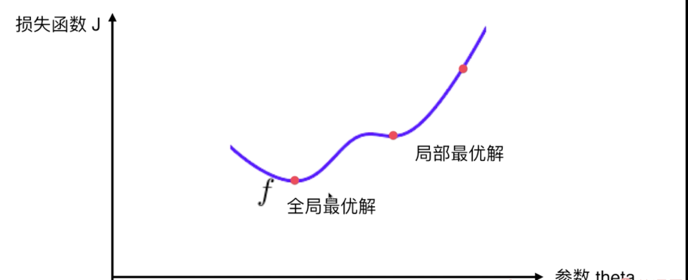

### 关于梯度下降法

- 不是一个机器学习算法
- 是一种基于搜索的最优化方案
- 作用：最小化一个损失函数
- 梯度上升法： 最大化一个效用函数

也是人工只能领域内很重要的方法。

以二维坐标为例，对于我们的目的就是使得损失函数最小

如图所示 我们在找最小值，我们知道 在曲线上求解最小值或者最大值，我们可以求导。
另外，这是一个二维的图，

对于高纬度的数据，那么要对各个维度的损失函数找到最小是，即求导
即：梯度下降，注意梯度的由来。

注意上图中的参数 一踏  η 非常重要的一个参数

* η称为学习率(learning rate)
* η的取值影响最优解的速度
* η取值如果不合适，甚至可能得不到最优解
* η是梯度下降法的一个超参数
对于 η的取值大小如图

过大和过小都会存在问题。

当然对于上面的图，我们用来解释 什么是梯度下降，用了比较理想的一个模型。二次曲线又唯一的取值点，
但是在实际情况中，我们的模型相对复杂和不规则， 比如

很明显，在这个模型中，存在两个极值

所以总结的话：并不是所有的函数都有唯一的极值点

解决方案：
- 多次运行，随机初始化点
- 梯度下降法的初始点也是一个超参数

