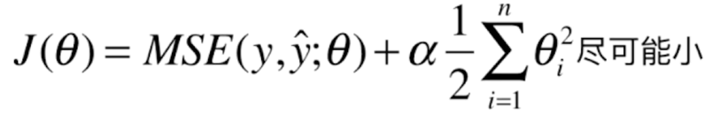

### 关于模型正则化和岭回归

模型正则化：限制参数的大小。

一线性回归问题为例：

很明显，我们的目的是找到 θ 尽可能的小，在化简求导之后其实可以得到：

就是求 θ 的值尽可能的小。

当然，对于加入模型正则化的化，可以得到目标函数：

所以想使得 j(θ)尽可能的小，那么就使得多项式的中的每一项都尽可能的小。

随意最后推导的化。就是要找到每一项的 θ 值最小。

这种方式有称之为岭回归。 