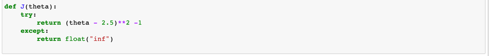

### 模拟实现梯度下降法

先绘制一个简单的曲线

我们要实现梯度下降，那么根据上节文档中对于梯度下降的实现 

描述： 对于一个函数，求导看是否到了极值，（就这个二次曲线而言有唯一解）
那么， 首先对曲线方程进行求导 定义函数dj()
定义当前theta点的损失函数 J()
记录每次theta的变化

那么 我们如果能记录到每次theta的变化，将每次的变化描述在图像上，会更加清晰一点，

我们形象的可以从图像上看到每次theta的变化

注意到上面代码中，也是梯度下降中重要的一个参数  η  也就是我么的学习率，如果调整我们 η 参数会怎么样子呢？

先继续减小 η

从图上可以看到 我们的学习率变低了，我们需要更多的step来找到最小值

如果增大 η 呢

我们可以看到，梯度每次还是下降的，也就是是 我们依然可以找到最小值，所以我们的 η 是不能超过某个值的
只要每次是梯度下降就好。

假设 η 过大呢？

python会编译报错，为了避免报错 我们修改下损失函数的代码 

再次运行代码，报错没有了

但是我们得知道此时代码进入了一个死循环，在封装的方法中 
J(theta) J(last_theta)都是无穷大，在py中无穷大减去无穷大，是nan 这 if永远不会被触发
所以我们再次修改代码。

如代码所示，我们增加一个参数 修改 while循环，限制循环的次数

对于 η  设置为0.01 一般对于大多数函数都可以，如果不能确定， 就采用上述方法 对 η 进行绘制 看看实际情况