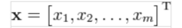
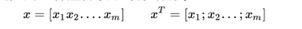

### 关于矩阵的一些整理

行向量：行向量在线性代数中，是一个1*n的矩阵。也就是说矩阵是由一个含有n个元素的行所组成的向量。
行向量的转置是一个列向量。

为了简化书写。有时会以加上转置符号T的行向量表示列向量。

为进一步化简，习惯上会把行向量和列向量都写成行的形式。不过行向量的元素是用空格或逗号隔开，列向量则用分号隔开。例如，假设x是一个行向量，
那么x和x的转置就可以如下方式表示

