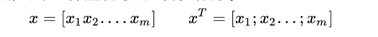
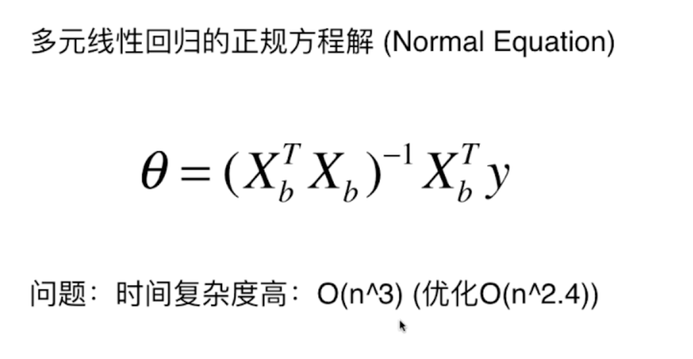

### 回归算法的评价

在分类问题中，我们说在所有数据集中 取出一部分数据作为训练数据集。一部分作为测试数据集
使用训练数据集在训练模型，使用测试数据集来测试我们训练的模型，可以得到一个分类的准确度
accuracy

那么对于回归呢，如何评价模型呢， 回到最初的简单的线性回归问题中， 如图

在线性回归中，我们的最终目的是找到（计算a,b）使得a, b尽可能的小 (可参照图像理解)

在实际训练模型中，对于ab的求值 是对于训练的数据集来说的，如下

那么衡量模型的时候，使用的数据集是test的数据集那么可以得到：

注意 m 参数， 实际中并不能以数量来衡量一个模型的好坏，那么优化就是：

来消除数量对于模型的影响。这种方式我们称之为均方误差（MSE）（Mean Squared Error）

### 关于均方误差

定义： 是反应估算量与被估算量之间的差异程度的一种度量。
均方根误差 RMSE (要在同一量纲下)

另一种方式：

