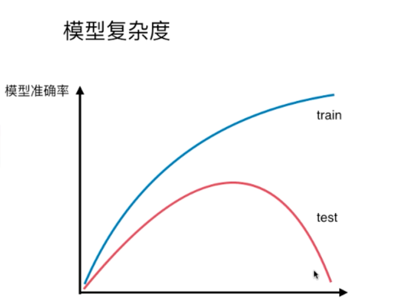
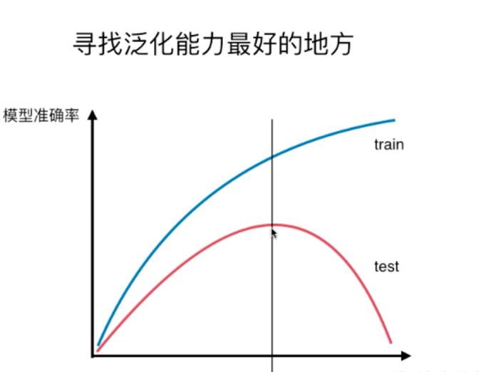
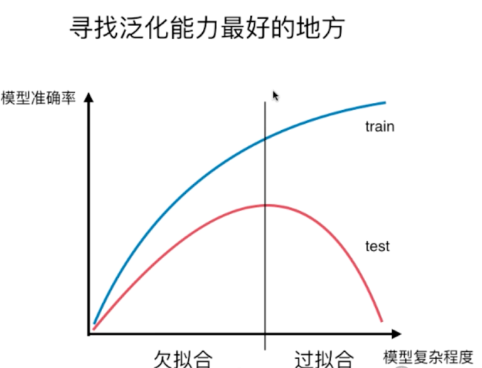

### 关于训练数据和测试数据

问题一： 为什么要把数据分为测试数据和训练数据呢？

其实 就是上一次我们说到的 可能出现的过拟合的现象。通俗易懂的说，就是 对于训练数据来说，模型拟合的非常的好
在极限情况下 所有的数据特征都可以被找到，拟合在曲线上，那么我们这种情况就是过拟合，过拟合对于模型的泛化能里比较弱，过拟合的成都越高。泛化能力
越差。

如果是测试数据正常训练一个模型，没有拟合的现象。在这种情况下，我们得到的一个模型是以训练数据为基础的，那么对于测试数据来说。这些是全新的数据，
如果测试数据也能正常的得到结果，那么我们说我们模型的泛化能里非常的好。

