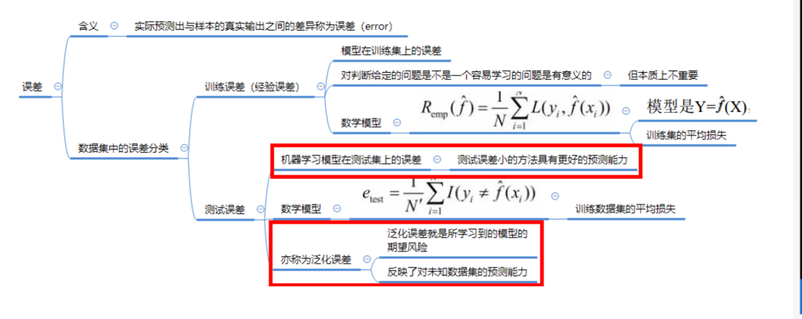
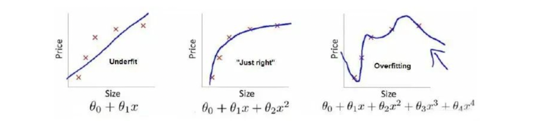
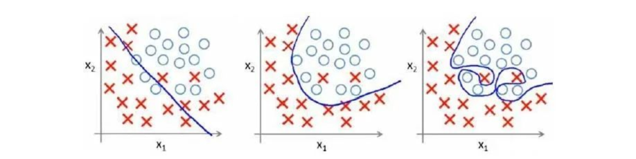
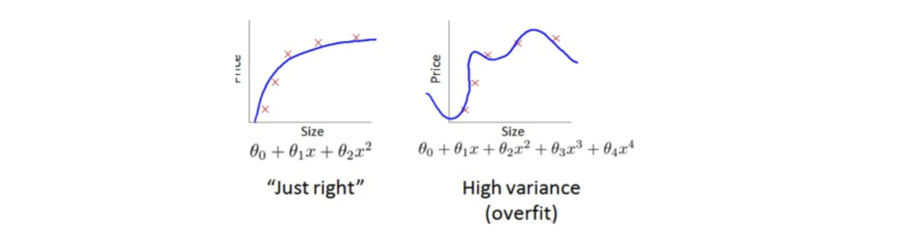

### 关于 fitting and overfitting

1: 关于机器学习中的误差
   一般的，将机器学习的实际预测输出与样本的真实输出之间的差异称之为 "误差" (error)

统计学习的目的是使得学到的模型不仅对已知数据而对未知数据都有很好的预测能力。不同的学习方法给出不同的模型。当损失函数给定时，
基于损失函数的模型训练误差和模型预测误差就自然成为学习方法的评估标准。

2：过拟合与欠拟合

  2.1: 期望月误差
  在机器学习中， 我门理论上希望误差越小越好，但期望误差又不能直接求得，所以使用经验误差来估算期望误差，因此。希望机器学些模型预测
输出值与真实值间的误差越小。

但是， 实际情况是并不是经验误差(期望误差)越小越好，如果过小，则可能是的模型训练集中表现的非常好，在测试集中表现的非常差，就是说
过于强调拟合原始数据，而丢失了算法的本质，若给出一个新的值使之预测，它将表现的非常差，将次现象称之为过拟合。

如图所示：

上图是回归问题。其实在分类问题中也存在这样的问题，如图所示：

2.2: 过拟合

过拟合就是训练误差和泛化误差间的差距太大，即过度的训练数据集本身，而忽略了它的规律，导致训练集的误差<<验证集的误差，
也就是说模型的学习能力太强了，以至于吧样本中所包含的一般的特征都学习到了。

过拟合的根本原因是：特征唯独过高。导致拟合的函数完美经过训练集，但是对新数据的预测较差。即指选择的模型包含的参数过多，模型
复杂度高。以至于出现一模型对已知的数据预测的很好，但对于未知的数据预测的很差。

如图所示：

