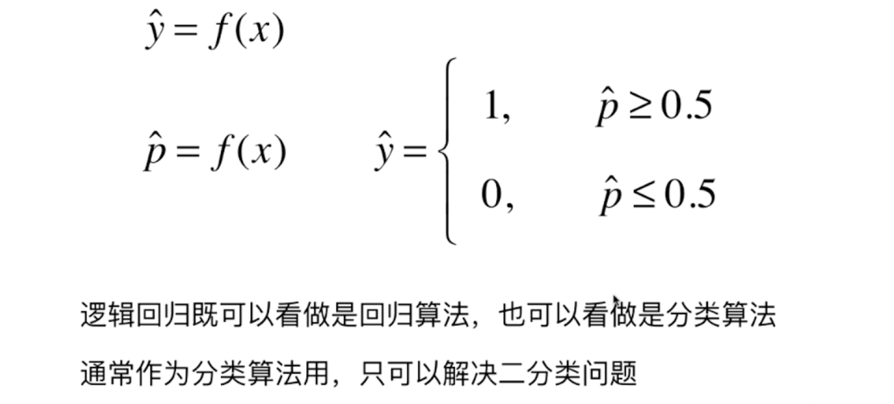
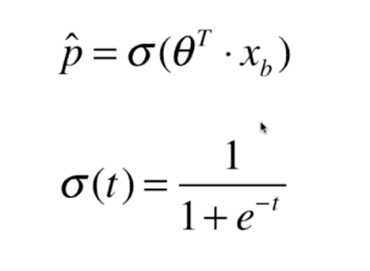
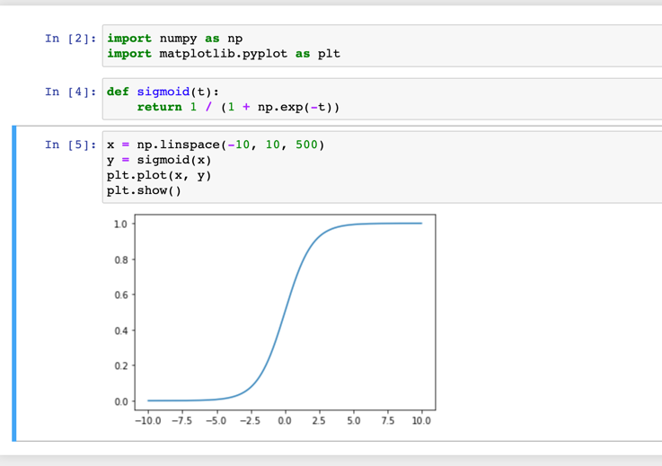
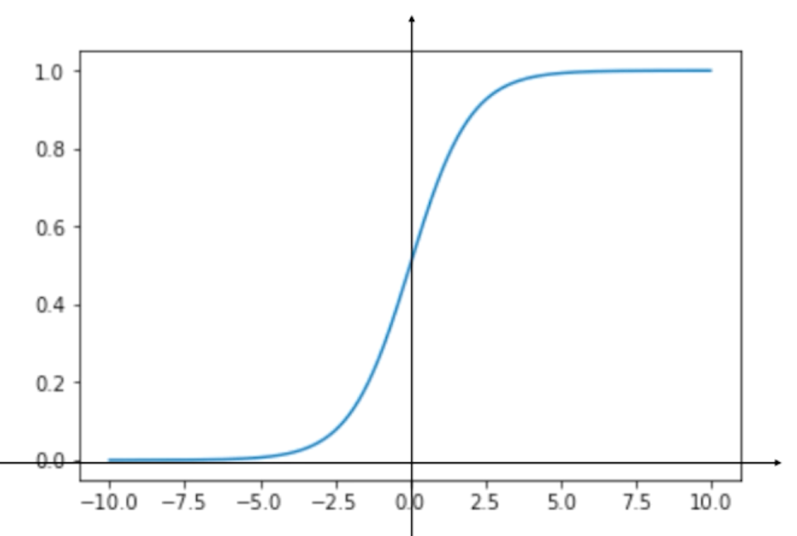

### 关于逻辑回归

逻辑回归解决的是分类了为题。这个要注意
逻辑回归是将样本的特征和样本发生的概率联系起来。概率是一个数。

对比线性回归， y得到的是一个近似值。
而对于逻辑回归。我们得到的一个值是一个概率p。

其实逻辑回归本身只能解决二分类的问题。

对于线性回归 他的值域 [-infinity, +infinity]
对于逻辑回归，概率的值域为[0, 1]

### Sigmoid函数

我们实际的绘制图像看看

很明显，图像的值域是(0, 1)

, 根绝图像我们可以得到一个结果

t > 0 , p > 0.5
t < 0 , p < 0.5