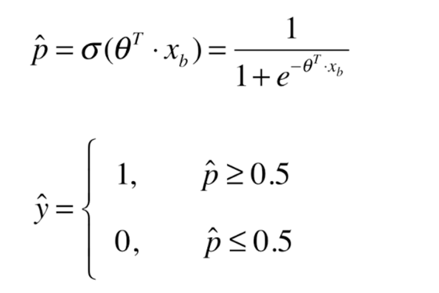
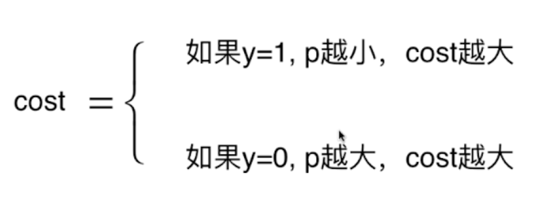
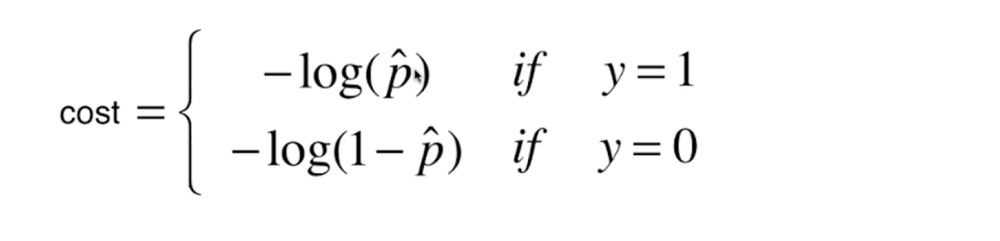
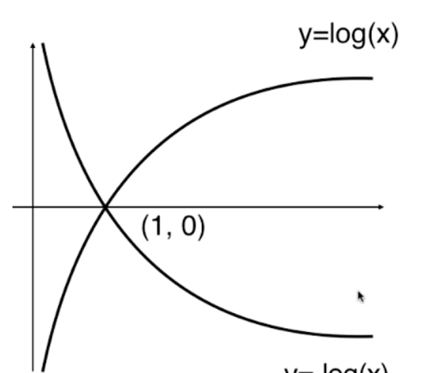
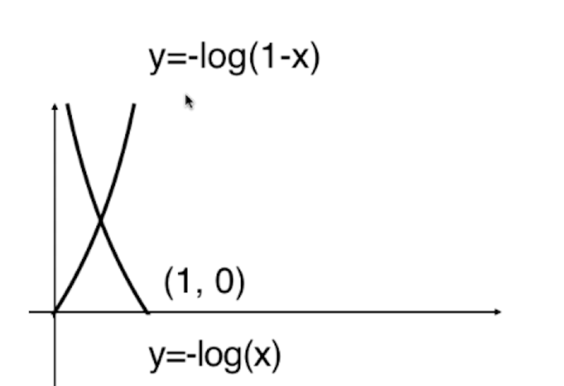
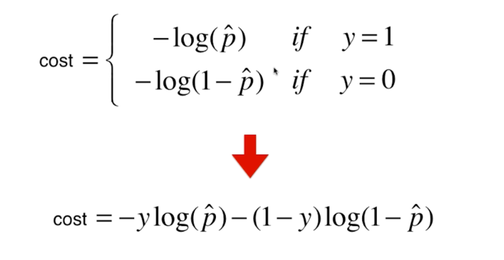
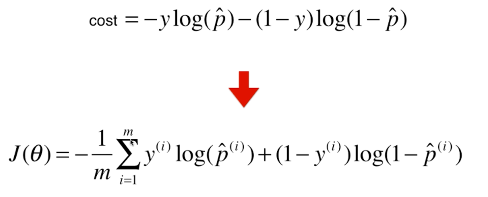
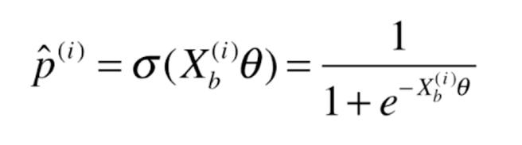
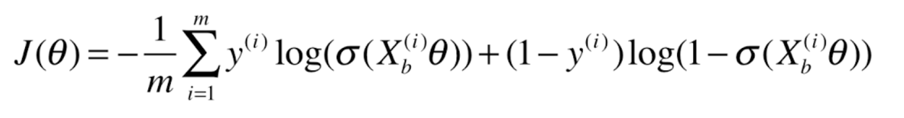

### 关于逻辑回归的损失函数

其实上次有了解见到对于逻辑回归，其本身只能解决二分类问题
但是结合线性回归，我么可以解决不同的问题

最终会得到一个：

对于样本xb, 如果最终计算的结果概率是 大于等于 0.5 我们将分为1 类，否则我们就分为0类。

这样我们就把线性回归结合进逻辑回归当中了。

对于损失函数。我们也可以分为2类

损失函数：

图像如下：

但是要注意函数的值域 (0, 1), 最终得到： 

简化损失函数： 

 =>

关于函数中的 p̂(i) 是上次推导过的

 如果带进去的化可以得到：

随意目前的问题就是如果求的 j(θ)的最小指了～

今天的内容是枯燥乏味了一点～ 暂时先这样理解了

#### 接上回，我们已经得到了关于j(θ)的函数。对于这个函数没有明确的解，我们可以是使用梯度下降法求最优解

要使用梯度下降法，则要对表达式中的θ进行求导， 如图所示，这个和线性回归是一直的，整个过程就不在这里赘述了。

