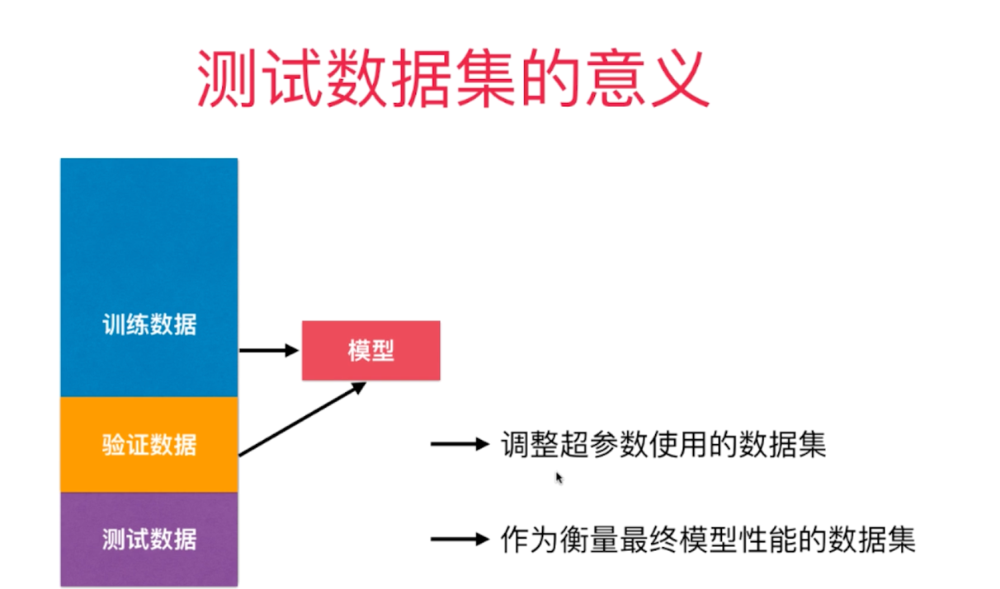
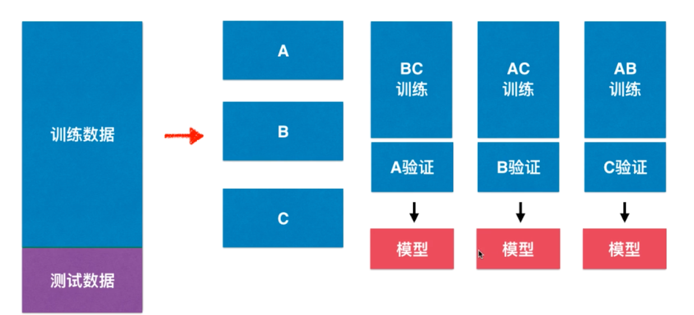
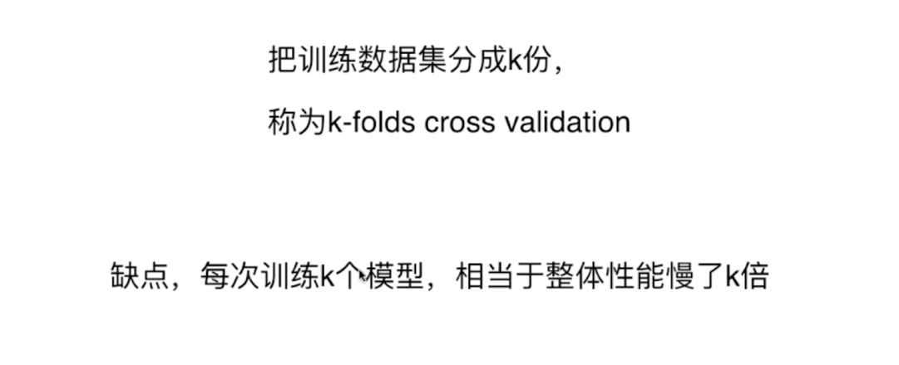

### 测试数据集的意义

上次我们说到关于训练数据集和测试数据集。

其实对于测试数据集，如果模型误差过大。我们基于测试数据集去调整对应的参数。

但是这样会存在一个问题，如果我们按照测试数据调整了模型的参数使得模型能够很好的拟合，那么会造成在测试数据的过拟合。

所以我们对于数据的处理还是需要验证数据。如图所示

把数据分为3部分

训练数据用与对模型的训练。
验证数据来验证我们的模型，如果需要调整再基于验证数据来调整
最终的测试数据对于模型是全新的数据。来最终测试我们的模型。

### 交叉验证 cross validation

如图，我们可以将数据分为不同的分数，进行交叉验证。

这个结果很明显了。整个过程的性能将会慢K倍。