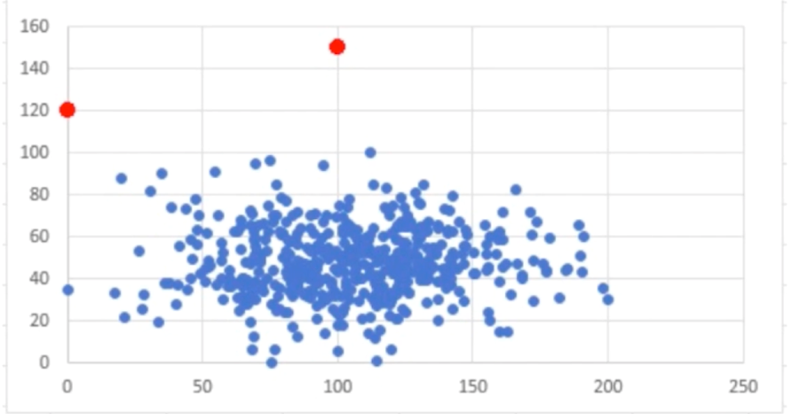
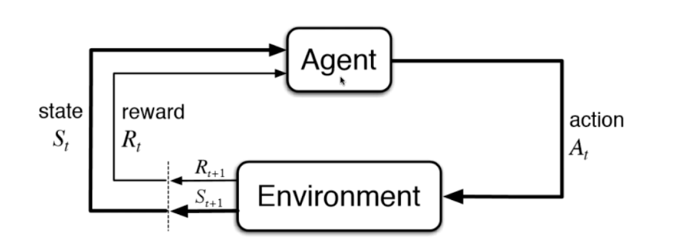

机器学习的几个分类
(并不是唯一标准)
一下是按照基本机器学习算法进行分类

1：监督学习
2：半监督学习
3：非监督学习
4：增强学习

### 监督学习（拥有标记）
1： 给机器学习的的训练数据拥有 "标记"或者说是答案
对于监督学习 主要解决两方面的问题，一是分类，二是回归。

## 非监督学习

给机器的数据是没有任何标记或者答案。非监督学习的意义就在于对没有 "标记"的数据进行分类-----聚类分析
另外 非监督学习可以对数据进行降纬处理，具体表现在
1：特征的提取
2：特征的压缩 （pca）
   在面临非常高纬的数据的时候
   就是在尽量少的损失数据的情况下，将高纬的特征向量压缩成低纬的特征向量，从而大大的提高机器学习的运行效率
另一方面 对数据降纬的意义就在于： 方便可视化（人难以理解3维以上的space）

3：非监督学习还可以完成异常的检测，比如在数据集中部分数据是有明显的异常的 

比如 图中2个红点就是明显的异常数据。对于异常的数据并不能表达我们模型中常规特征或者说是一般特征,所以对我们最终的结果是没有影响的

### 半监督学习
一部分数据具有“标记”或者是“答案”，另一部分数据没有，此中情况在实际中更加常见。因各种原因产生的标记缺失。

### 增强学习
无人驾驶
机器人
（监督学习和半监督学习是基础）

根据周围的环境情况，采取行动，根据采取行动的结果，学习行动方式.

