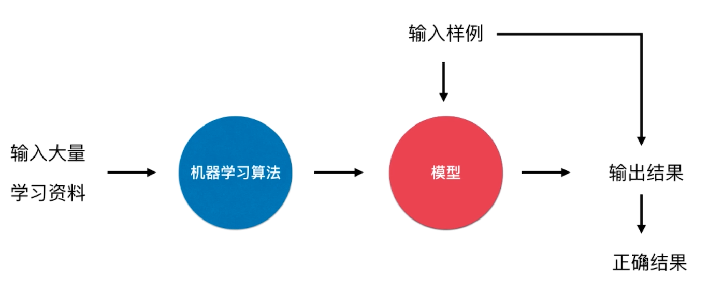

机器学习的其他分类

### 批量学习和在线学习

1：批量学习(batch learning)
2: 在线学习 (Online Learning)

所谓批量数据学习 就是拿到部分数据 通过算法得到模型 从而可以输出结果，在实际过程中会有其他不断的新的样例，但是这些新的样例不会优化当前的模型。
优点在于：简单
带来的问题就是：如何适应环境的变化？
方案：定时重新批量学习 --> 缺点：每次重新批量运算，运算量巨大。

在线学习：

优点： 及时反应新的环境变化
同时也会带来一定的问题：新的数据带来不好的变化
解决方案：需要加强对数据进行监控。

### 参数学习

特点：一点学习到了参数，就不需要原来的数据集，最典型的线性问题

### 非参数学习
- 不对模型进行过多的假设
- 非参数不等于没有参数

####、关于机器学习的其他一些内容

- 数据本身的重要性
- 数据驱动

- 收集更多的数据
- 提高数据的质量
- 提高数据的代表性
- 研究更重要的特征

机器学习解决是不确定的问题，

没有免费的午餐的定理
-  可以严格的数学推导出： 任意两个算法，他们的期望性能是相同的 （这里的期望是数据期望，在概率论和统计学中，数学期望(mean)是试验中每次可能的结果的概率乘以其结果的总和，是基本的数学特征之一
   它反应随机变量平均取值的大小。）别名均值，期望，表达是E(x)
   
其实说 如果脱离具体问题，具体的算法是没有实际意义的
