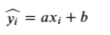
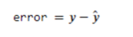
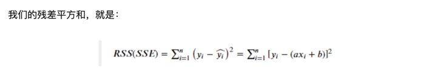
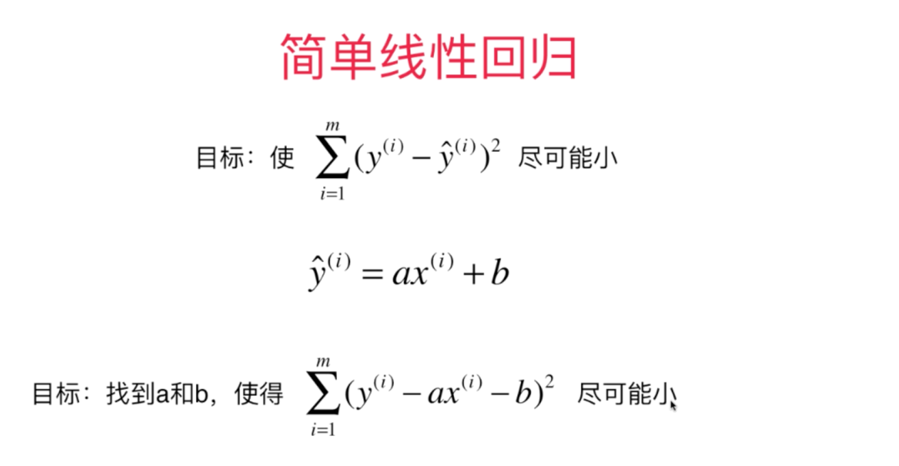
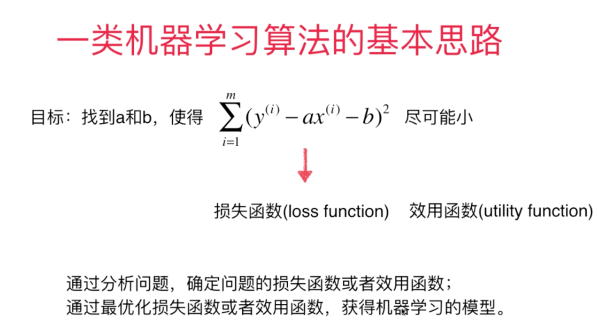
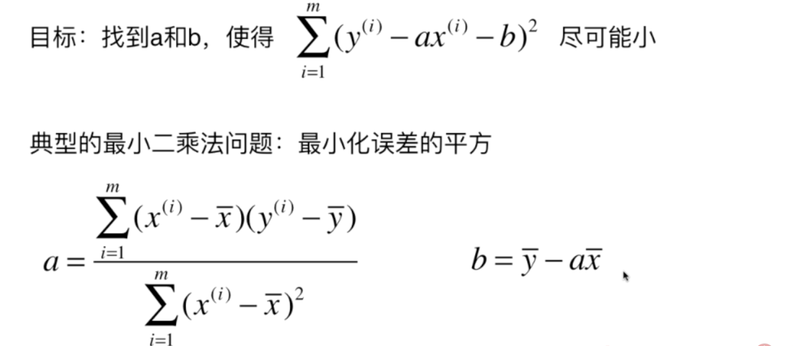
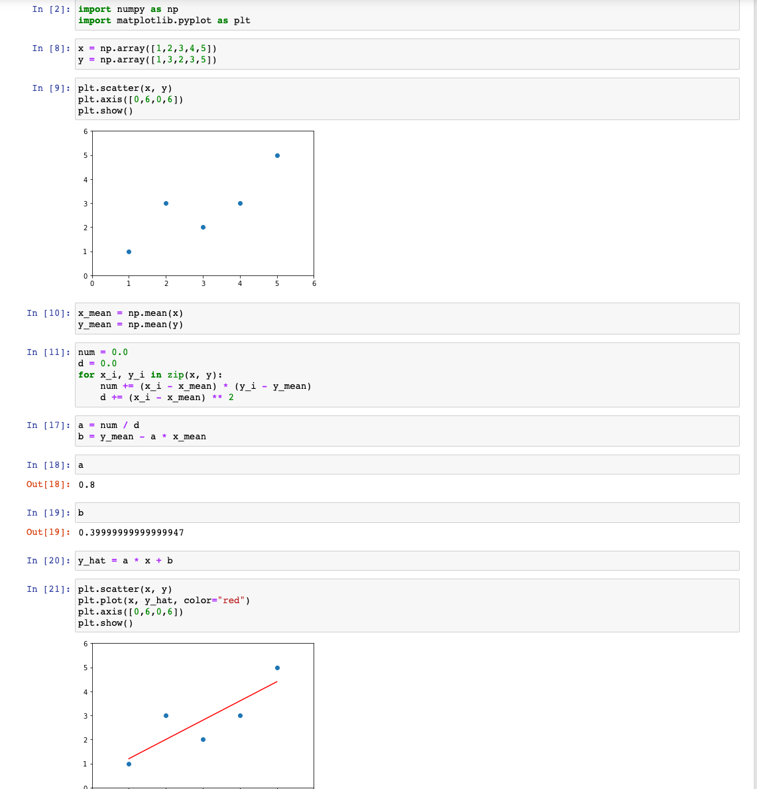

### 关于线性回归算法

- 解决回归问题
- 思想简单，容易实现
- 结果具有很好的解释性
- 蕴含机器学习中的很多重要的思想

什么是线性回归？

简单线性回归的原理以及数学推导

简单线性回归为一元线性回归模型，是指模型中只含有一个自变量和因变量，该模型的数学公式可以表示为y=ax+b+ε，a为模型的斜率，b为模型的截距，ε为误差。

对于简单线性回归，函数可以用可以用一个公式来表示，假设x和y之间存在这样的关系：

其中等号左边带的y是我们y的预测值，实际情况时我们预测的数值与实际数值之间的差异，就是残差，即：

我们的目的是使得预测值尽可能地接近实际值，即残差越小越好。也就是说，当我们找到一组（a, b），使得残差平方和最小时，就说明在某种程度上，
我们找到了预测效果最好的简单线性回归模型。

关于回归：
回归。指研究一组随机变量(Y1 ，Y2 ，…，Yi）和另一组(X1，X2，…，Xk)随机变量之间关系的统计方法，又称为多重回归分析

回归分析的内容：
1： 从一组数据出发，确定某些变量之间的定量关系，即建立数学模型并估算位置参数，通常用最小二乘法
2： 检验这些关系式的可信任程度
3：在多个自变量影响一个应变量的关系中，判断自变量的影响显著，并讲影响显著的选中模型，剔除不显著的变量，通常用逐步回归，向前回归和向后回归等方法
4： 利用所求的关系对某一过程进行预测或控制

回归的种类：
线性回归，曲线回归。二元logistics回归，多元logistics回归。

线性回归要做的事情

一类机器学习算法的基本思路

近乎所有的参数学习算法都是这样的讨论。
比如：  线性回归 多项式回归 逻辑回归 SVM  神经网络

再次回到线性回归： 我们的目标

如下所示， 从代码层面实现公式

