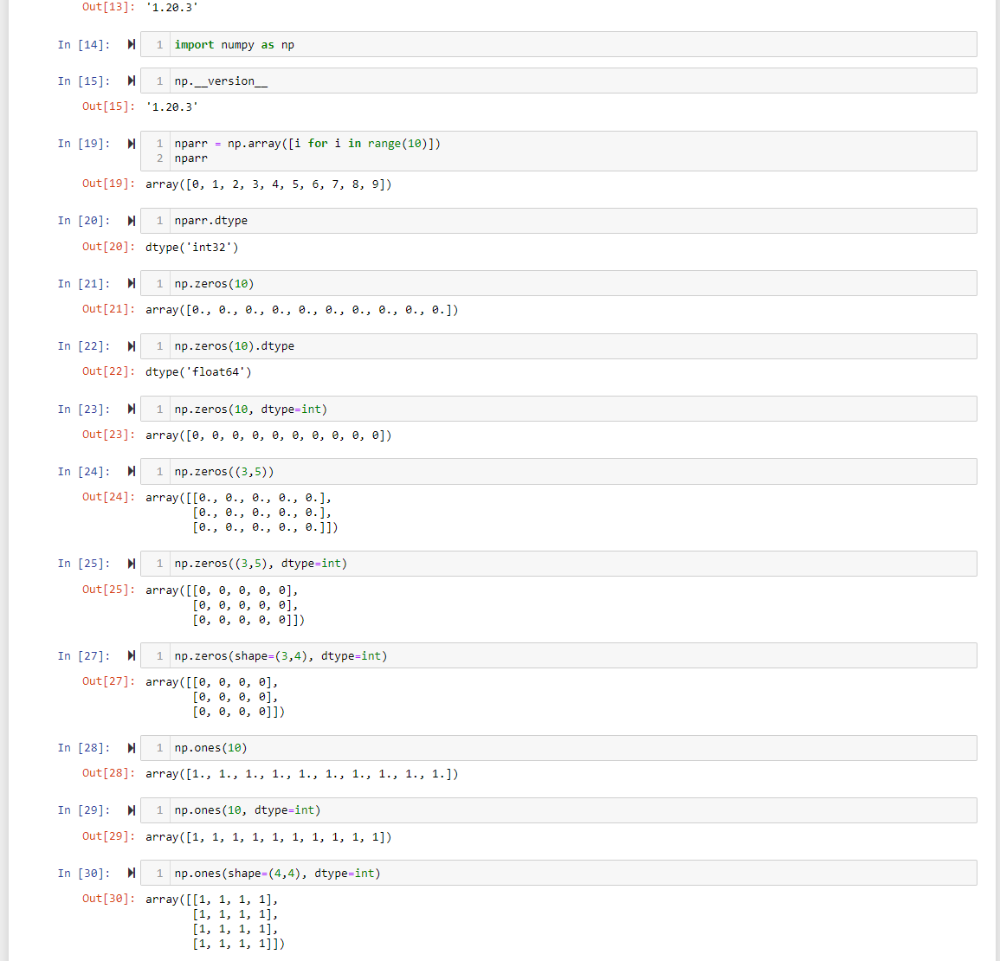
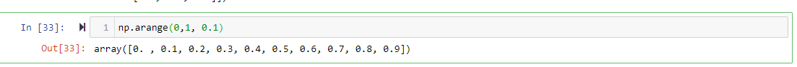
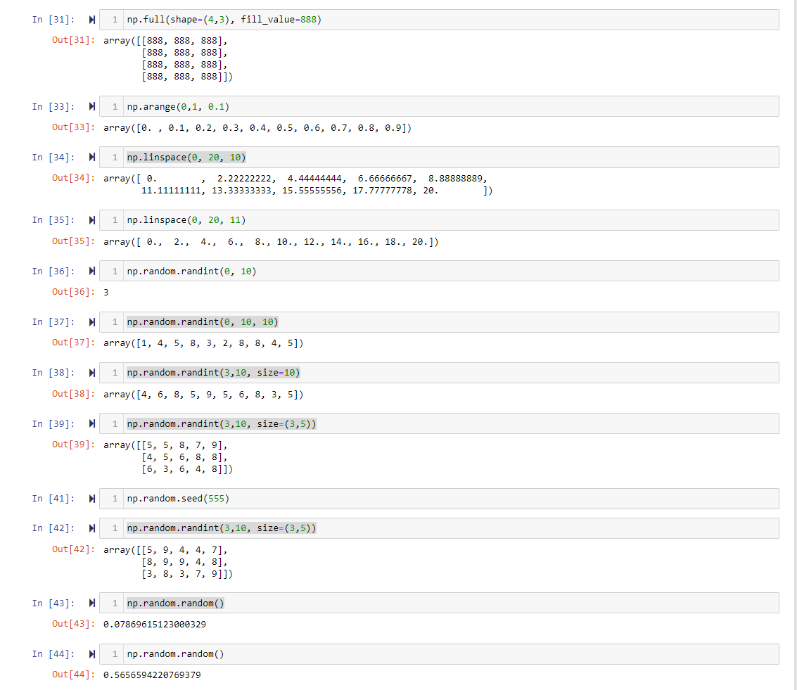
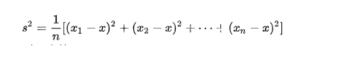
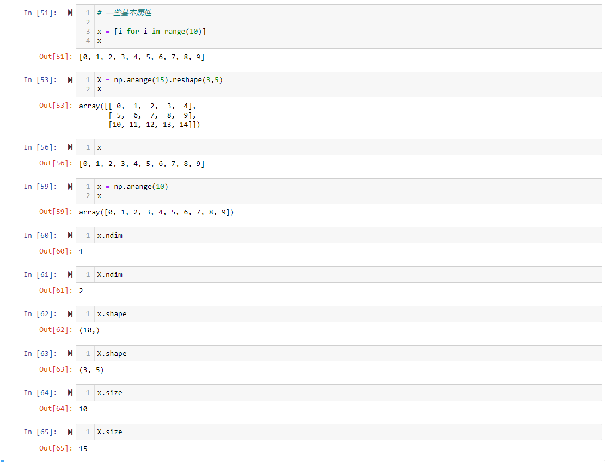

关于numpy的使用
numpy（Numerical Python）提供了python多多维数组对象的支持：ndarry,具有矢量运算能力，快读，节省空间。
numpy支持高级大量的维度数组与矩阵运算，另外也提供了大量针对数组的函数运算库

1：numpy中类型是限定的，py的list或者是array中数据类型是不限定的

2：在py中arange中步长只能是int，但是在numpy中  numpy.arange(0, 1, 0.2), step可以使用浮点型！ 不填写 step就是1

3: 一些其他用法

4： 关于一些随机数
    一些基本概念
    * 均值， 方差

所谓均值，是表示一组数据中集中趋势的数量，是指在一组数据中所有数据之和再除以这组数据的个数，它反应的是数据集中趋势的一项指标。
方差：方差是各个数据与平均数之差的平方的和的平均数。
    eg: 有 1、2、3、4、5这组样本，其平均数为（1+2+3+4+5）/5=3，而方差是各个数据分别与其和的平均数之差的平方的和的平均数，则为：
    [(1-3)^2+(2-3)^2+(3-3)^2+(4-3)^2+(5-3)^2]/5=2，方差为2。
公式记作： 

其中，x表示样本的平均数，n表示样本的数量，Xi表示个人， S^2表示方差

5: 一些基本的概念

6：numpy.array的数据访问
